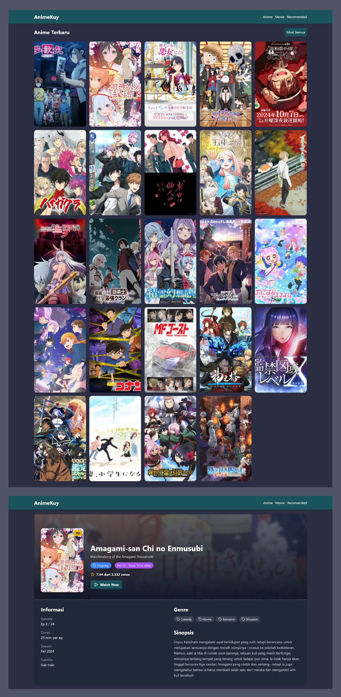

<div align="center" id="top"> 
  

&#xa0;

  <!-- <a href="https://nontonanime.netlify.app">Demo</a> -->
</div>

<h1 align="center">AnimeKuy</h1>

<p align="center">
  

  

  

  

  

  

  
</p>

<!-- Status -->

<h4 align="center">
	🚧  AnimeKuy 🚀 Under construction...  🚧
</h4>

<hr>

<p align="center">
  <a href="#dart-about">About</a> &#xa0; | &#xa0; 
  <a href="#sparkles-pages">Pages</a> &#xa0; | &#xa0;
  <a href="#rocket-technologies">Technologies</a> &#xa0; | &#xa0;
  <a href="#white_check_mark-requirements">Requirements</a> &#xa0; | &#xa0;
  <a href="#checkered_flag-starting">Starting</a> &#xa0; | &#xa0;
  <a href="#memo-license">License</a> &#xa0; | &#xa0;
  <a href="https://github.com/suryamsj" target="_blank">Author</a>
</p>

<br>

## :dart: About

AnimeKuy is a platform for streaming and downloading anime with Indonesian subtitles. Featuring the latest and most complete anime collection, users can stream or download for offline viewing, all sourced via scrapping from trusted sites.

## :sparkles: Pages

- [x] Homepage
- [x] Latest Anime
- [x] Movie
- [x] Watch
- [ ] Status
- [ ] Year
- [ ] Genre
- [ ] Season
- [ ] Type
- [ ] Search
- [ ] AI Recomendation

## :rocket: Technologies

The following tools were used in this project:

- [Node.js](https://nodejs.org/en/)
- [Sveltekit](https://kit.svelte.dev/)
- [TypeScript](https://www.typescriptlang.org/)
- [Linkedom](https://www.npmjs.com/package/linkedom)

## :white_check_mark: Requirements

Before starting :checkered_flag:, you need to have [Git](https://git-scm.com) and [Node](https://nodejs.org/en/) installed.

## :checkered_flag: Starting

```bash
# Clone this project
$ git clone https://github.com/suryamsj/nonton-anime

# Access
$ cd nonton-anime

# Install dependencies
$ npm install

# Run the project
$ npm run dev

# The server will initialize in the <http://localhost:5173>
```

## :memo: License

This project is under license from MIT. For more details, see the [LICENSE](LICENSE) file.

Made with :heart: by <a href="https://github.com/suryamsj" target="_blank">Muhammad Surya J</a>

&#xa0;

<a href="#top">Back to top</a>
